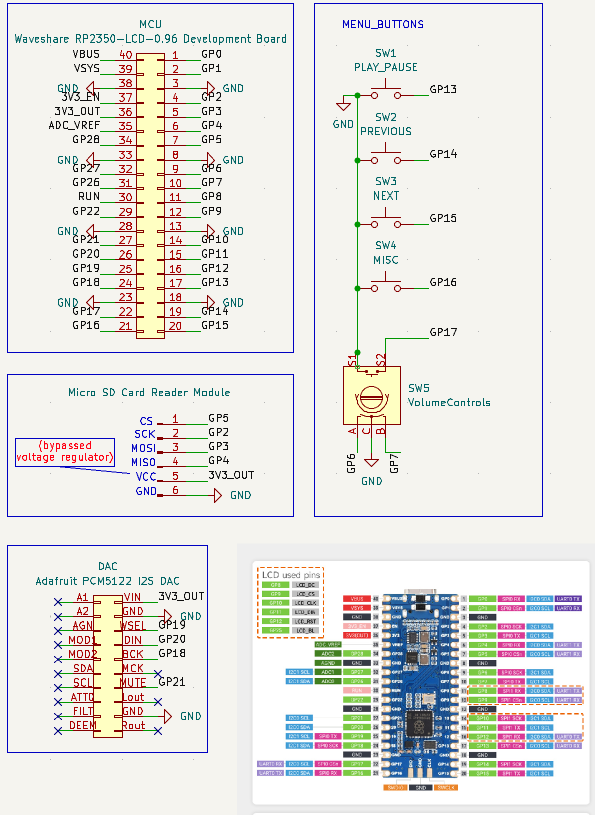
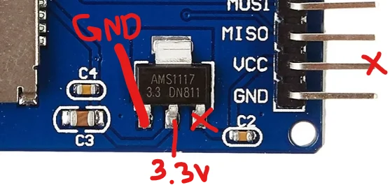

# **buhPod**

A portable, battery-powered music player that supports 3.5mm wired earphones, made under 25$.

## Bill Of Materials
\> View [bom.csv](./bom.csv) (WIP) 
Total cost is **~25$**

## CAD Design
- WIP
- View [/CAD directoy](./cad/) for more information

> **Rough assembly**
> 

## Schematics

Done in KiCAD: [Schematics folder](./schematics/)

Since there is no PCB (these are all components wired/soldered together), there are no PCB files.  
However, you can still open the schematics in KiCAD, by:
- Opening KiCAD
- Clicking **File** (top left) >> **Open Project**
- Navigating to the the repository's saved destination,
- Opening **/schematics** directory
- Selecting the file `buhpod.kicad_pro`

This will open the schematics in KiCAD for easier viewing! 
The schematics are as follows:

### Micro SD card regulator bypass

The Micro SD card reader mentioned in the BOM requires **5V** input from **VCC**, but we can only supply **3.3V** from the MCU max as we are powering it via a 18650 3.7V battery and not USB. 

Hence, we need to bypass the voltage regulator present on board by powering the board from the following **3.3V pin**:

This bypasses the onboard AMS1117 voltage regulator and is connected to MCU's `3V3_OUT` pin. 
This is also mentioned in the schematic for the Micro SD Card reader.

## References
- https://www.waveshare.com/rp2350-lcd-0.96.htm
- https://files.waveshare.com/wiki/RP2350-LCD-0.96/RP2350_LCD_0.96_Schematic.pdf
- https://learn.adafruit.com/adafruit-pcm5122-i2s-dac/downloads
- https://www.instructables.com/Raspberry-Pi-Pico-Micro-SD-Card-Interface/  
- https://circuitdigest.com/microcontroller-projects/raspberry-pi-pico-interfacing-with-rotary-encoder
- https://www.instructables.com/Raspberry-Pi-Pico-and-Rotary-Encoder/